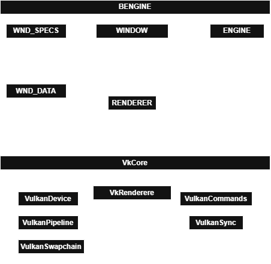

|  | **BWORLD** |
|------------------------------------------------------|--------------------------|

# Overview
This project is about the procedural and efficient generation of complex ecosystems within a graphics engine built from the ground up. In the context of said application, an ecosystem
will be defined in its minimal configuration as a composition of terrain features, fauna, and hydrospheric elements.

----

## Architecture

Minimal architecture*

## Features
